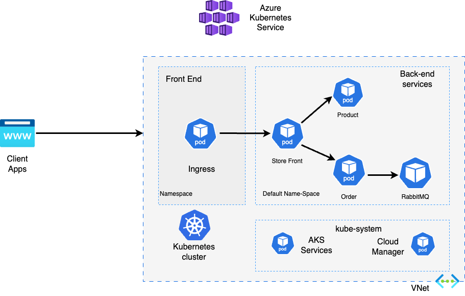

# How to Become a Cloud Solution Architect (CSA) - O'Reilly Course

Welcome to the **["How to Become a Cloud Solution Architect](https://www.oreilly.com/library/view/becoming-a-cloud/0642572030667/?_gl=1*1n464e6*_ga*MTkxNjMyMDY2My4xNzQzMjE3MzA4*_ga_092EL089CH*MTc0MzIxNzMwNy4xLjEuMTc0MzIxNzMyNy40MC4wLjA.)"** course by O'Reilly! This guide will walk you through the capstone materials, including translating business requirements into technical architecture, presenting your architecture, deploying an AKS cluster, and setting up the AKS demo store.

---

## Table of Contents
1. [Translating Business Requirements into Technical Architecture](#1-translating-business-requirements-into-technical-architecture)
2. [Presenting Your Architecture](#2-presenting-your-architecture)
3. [Deploying a Basic AKS Cluster](#3-deploying-a-basic-aks-cluster)
4. [Deploying the AKS Demo Store](#4-deploying-the-aks-demo-store)
5. [Socials and Contact Information](#5-socials-and-contact-information)

---

## 1. Translating Business Requirements into Technical Architecture

To effectively translate business requirements into technical architecture, we use **Draw.io**, a powerful diagramming tool.

### Steps to Use Draw.io
1. **Open Draw.io**: Visit [Draw.io](https://www.draw.io) and choose to use it online or download the desktop version.
2. **Create a New Diagram**: Select "Create New Diagram" and choose a blank or pre-defined template.
3. **Define Business Requirements**: List all requirements, such as user needs, performance metrics, or compliance goals.
4. **Translate Requirements into Architecture**:
   - **Components**: Drag and drop elements like AKS clusters, Kubernetes pods, and networking components.
   - **Connections**: Use arrows to show interactions between components.
   - **Annotations**: Add labels and text to explain each component's purpose.
5. **Save and Share**: Export your diagram in formats like PNG, SVG, or PDF and share it with stakeholders.

### Reference Diagram
For inspiration, check out the reference diagram presented during the module:  


---

## 2. Presenting Your Architecture

Effectively presenting your architecture is crucial for stakeholder understanding and approval.

### Tips for a Successful Presentation
- **Start with an Overview**: Provide a high-level summary of the architecture.
- **Break It Down**: Explain each component and its role in the system.
- **Use Visual Aids**: Include diagrams (e.g., from Draw.io) to simplify complex concepts.
- **Highlight Key Points**: Focus on scalability, security, and integration.
- **Prepare for Q&A**: Anticipate questions and have detailed answers ready.

---

## 3. Deploying a Basic AKS Cluster

### Prerequisites
Before deploying an AKS cluster, ensure the following:
- **Kubernetes Basics**: Familiarize yourself with [Kubernetes core concepts](https://learn.microsoft.com/en-us/azure/aks/concepts-clusters-workloads).
- **Azure Subscription**: Create a [free Azure account](https://azure.microsoft.com/free/) if you don’t already have one.
- **Azure Cloud Shell**: Review the [Azure Cloud Shell Overview](https://learn.microsoft.com/en-us/azure/cloud-shell/overview).

### Steps to Deploy an AKS Cluster
1. **Access Azure Portal**: Log in to the [Azure Portal](https://portal.azure.com).
2. **Create a New AKS Cluster**:
   - Navigate to "Create a resource" > "Kubernetes Service."
   - Fill in details like Subscription, Resource Group, and Cluster Name.
   - Choose the "Dev/Test" profile for a sandbox environment.
   
3. **Configure Cluster Settings**:
   - **Node Pools**: Set the number of nodes and VM size.
   - **Authentication**: Use default settings for Azure AD or Kubernetes RBAC.
   - **Review and Create**: Verify settings and click "Create."
4. **Access the Cluster**: Use Azure CLI or the Kubernetes dashboard to manage the cluster.
   

---

## 4. Deploying the AKS Demo Store

Deploying the AKS demo store involves setting up a sample application on your AKS cluster.

### Steps for Deployment
1. **Prepare the Application**:
   - Obtain the [YAML source code](aks-store-quickstart.yaml).
   - Use the Azure Cloud Shell editor to create Kubernetes manifests.
   - Follow the "Connect to AKS Cluster" workflow in the Azure portal.
   
2. **Deploy the Application**:
   - Run `kubectl apply -f <manifest-file>.yaml` to apply the manifests.
   - Monitor the deployment with `kubectl get pods` and `kubectl get services`.
   - Example terminal output:
     ```
     deployment.apps/rabbitmq created
     service/rabbitmq created
     deployment.apps/order-service created
     service/order-service created
     deployment.apps/product-service created
     service/product-service created
     deployment.apps/store-front created
     service/store-front created
     ```
3. **Access the Application**:
   - Check pod status with `kubectl get pods` (ensure all pods are running).
   - Find the public IP of the store-front service using `kubectl get service --watch`.
   - Example output:
     ```
     NAME          TYPE           CLUSTER-IP    EXTERNAL-IP    PORT(S)        AGE
     store-front   LoadBalancer   10.0.200.10   40.62.155.23   80:30025/TCP   9m
     ```
   - Open the public IP in your browser to access the store app.  
     

---

## 5. Socials and Contact Information

Stay connected and follow course updates through these channels:
- **Twitter**: [@TheKevinEvans](https://twitter.com/TheKevinEvans)
- **LinkedIn**: [Kevin Evans Profile](https://www.linkedin.com/in/kevinevans01/)
- **Website**: [Code To Cloud](https://codetocloud.io)

---

Thank you for taking this course! We hope it helps you on your journey to becoming a Cloud Solution Architect.
