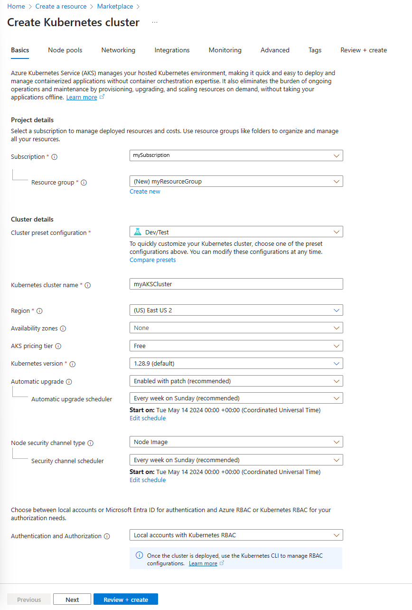
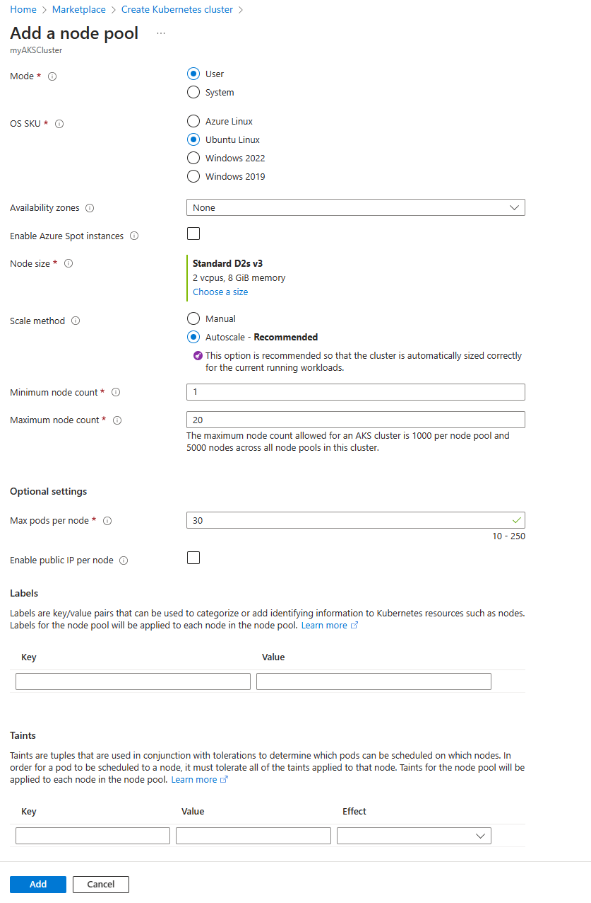
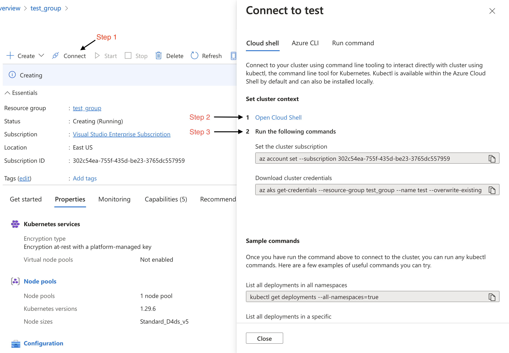
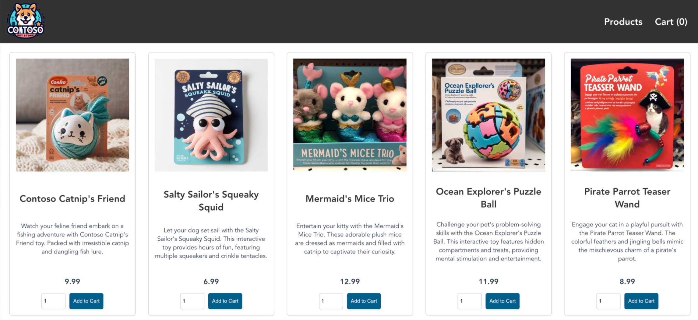

# How to Become a CSA - O'Reilly Course

Welcome to the "How to Become a Cloud Solution Architect" course provided by O'Reilly. This README will guide you through the course capstone materials, including translating business requirements into technical architecture, presenting your architecture, deploying an AKS cluster, and deploying the AKS demo store. Let's get started!

## 1. Translating Business Requirements into Technical Architecture with Draw.io

### To effectively translate business requirements into technical architecture, we use Draw.io, a powerful diagramming tool. Here's how to get started:

#### 🛠️ Steps to Use Draw.io

- Open [Draw.io](www.draw.io): Go to Draw.io and choose to either use it online or download the desktop version.
- Create a New Diagram: Start by selecting "Create New Diagram" and choose a blank template or any template that suits your project.
- Define Business Requirements: List out all the business requirements you need to address. This might include user needs, performance metrics, or compliance requirements.

#### Looking for inspration ?
- Take a look at the refrecne diagram, I presented during the module presentation [here](./Capstone.drawio.png).

#### Translate Requirements to Architecture:

- Components: Drag and drop different components like AKS clusters, kubernetes pods, and networking elements from the sidebar.
- Connections: Use arrows to show interactions between components.
- Annotations: Add text and labels to explain the purpose and functionality of each component.
- Save and Share: Once your diagram is complete, save it in your preferred format (e.g., PNG, SVG, PDF) and share it with stakeholders.

## 2. Presenting Your Architecture

### Effective presentation of your technical architecture is crucial for stakeholder understanding and approval. Here’s how to present your architecture effectively:

#### 🎤 Presentation Tips
- Start with an Overview: Begin with a high-level overview of the architecture to provide context.
- Break It Down: Dive into each component and explain its purpose and how it fits into the overall system.
- Use Visual Aids: Use diagrams (from Draw.io) to illustrate complex interactions and data flows.
- Highlight Key Points: Focus on critical elements like scalability, security, and integration points.
- Q&A Session: Prepare for potential questions and have detailed explanations ready.

## 3. Deploying a Basic AKS Cluster with a Dev/Test Profile

### 🚀 Before You Dive In

#### Hey there! Before we get started, here are a few things to set you up for success:

- Kubernetes Basics: This quickstart assumes you’re already familiar with Kubernetes. If you need a refresher, check out the [Kubernetes core concepts for AKS](https://learn.microsoft.com/en-us/azure/aks/concepts-clusters-workloads).
- Azure Subscription: Don’t have an [Azure subscription](https://learn.microsoft.com/en-us/azure/developer/#understanding-accounts-subscriptions-and-billing) yet? No worries! Create your [free Azure account](https://azure.microsoft.com/free/?ref=microsoft.com&utm_source=microsoft.com&utm_medium=docs&utm_campaign=visualstudio) to get started.
- Azure Cloud Shell: If Azure Cloud Shell is new to you, make sure to review the [Azure Cloud Shell Overview](https://learn.microsoft.com/en-us/azure/cloud-shell/overview) so you're comfortable with the basics.

### Azure Kubernetes Service (AKS) is a managed Kubernetes service that simplifies the deployment and management of containerized applications.

#### 🚀 Steps to Deploy AKS

- Access Azure Portal: Log in to the [Azure Portal](https://portal.azure.com).
#### Create a New AKS Cluster:
- Navigate to "Create a resource" > "Kubernetes Service."
- Fill in the required details such as Subscription, Resource Group, and Cluster name.
- Choose the "Dev/Test" profile for a sandbox environment.



#### Configure Cluster Settings:
- Node Pools: Set up the number of nodes and VM size based on your development needs.
- Authentication: Configure Azure Active Directory or Kubernetes RBAC for cluster access. (Leave as default)
- Review and Create: Verify all settings and click "Create" to deploy your AKS cluster.
- Access the Cluster: Use Azure CLI or Kubernetes dashboard to manage and monitor your AKS cluster.



## 4. Deploying the AKS Demo Store

### Deploying the AKS demo store involves setting up a sample application on your AKS cluster.

### 🛠️ Steps for Deployment

#### Prepare the Demo Store Application:
- Obtain the application’s [YAML source code here](aks-store-quickstart.yaml).
- Create Kubernetes manifests (YAML files) for deployment using [code editor](https://learn.microsoft.com/en-us/azure/cloud-shell/using-cloud-shell-editor) in the Azure cloud shell.
- Follow the "Connect" to AKS cluster workflow in the azure portal.



#### Deploy the Application:

- Use Kubectl: Apply the manifests using kubectl apply -f <manifest-file>.yaml.
- Check Deployment: Monitor the status of the pods and services with kubectl get pods and kubectl get services.
- Once the deployment is complete, you should be presented with the following output in the terminal:

Terminal output:

```
deployment.apps/rabbitmq created
service/rabbitmq created
deployment.apps/order-service created
service/order-service created
deployment.apps/product-service created
service/product-service created
deployment.apps/store-front created
service/store-front created
```

#### Access the Application (testing):

- To see how your pods are doing, run `kubectl get pods` and check their status. Make sure all pods are in the **Running** state before moving on. 🚀
- Find the public IP address for your store-front app by checking its service details. Run `kubectl get service --watch` to keep an eye on the progress in real-time. 🚀📡
- When you first check the store-front service with kubectl get service --watch, the EXTERNAL-IP will likely show as <pending>:

```
NAME          TYPE           CLUSTER-IP    EXTERNAL-IP   PORT(S)        AGE
store-front   LoadBalancer   10.0.200.10   <pending>     80:30025/TCP   5m
```

- Once the EXTERNAL-IP updates to an actual public IP address, press CTRL-C to stop the kubectl watch process. You’ll then see something like this:

```
NAME          TYPE           CLUSTER-IP    EXTERNAL-IP    PORT(S)        AGE
store-front   LoadBalancer   10.0.200.10   40.62.155.23   80:30025/TCP   9m
```

- Now, take that public IP address, open your web browser, and head over to it to see your store app in action! 🚀🌐




### End of project guide

## 5. Socials and Contact Information

#### Stay connected and follow the course updates through the following channels:

- X(Twitter): @TheKevinEvans
- LinkedIn: [Kevin Evans Profile](https://www.linkedin.com/in/kevinevans01/)
- Website: [Code To Cloud](https://codetocloud.io)

#### GitHub: Author's Comments:
Thank you for taking this course. We hope you find it informative and useful in your journey to becoming a Cloud Solutions Architect!
